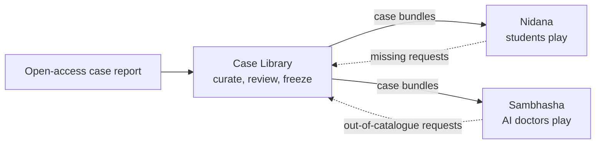

# Clinical-Case-Sim

Diagnostic simulation built from real, open-access case reports. Dr Atul Tiwari, Vedant Research Labs.

- **Case Library** (`case-library/`): one shared library of cases. Claude curates each case from an open-access report into the Case Vault (Supabase); Atul reviews it; it is frozen and exported as a case bundle.
- **Nidana** (`nidana/`): the teaching game. Students take the history, examine, order tests and commit to a diagnosis; Nidana scores and debriefs them. Planned for the App Store and Play Store.
- **Sambhasha** (`sambhasha/`): the research simulator. A team of AI doctor seats works up the same hidden cases; the results become a benchmark and a paper. Named after *sambhāṣā*, the structured discussion among physicians described in the Charaka Saṃhitā (Vimāna Sthāna 8).

## Status (25 Sep 2026)

Design agreed; build not started. The first Claude Code session sets up Git and the private GitHub repository (task U0.0 in `docs/PLAN.md`; the prompt is in `docs/SESSION_PROMPTS.md`), then the monorepo scaffold (U0.1). The Case Library's Phase 0 follows.

## Documents

| Where | What |
| --- | --- |
| `CLAUDE.md` | Rules for Claude in every part |
| `docs/DECISIONS.md` | Shared decisions |
| `docs/REPOSITORY.md` | Repository strategy and the research release |
| `docs/CHANGELOG.md` | Shared-contract changes and acknowledgements |
| `docs/PLAN.md` | Umbrella tasks and the order of milestones |
| `docs/SESSION_PROMPTS.md` | Prompts for starting Claude Code sessions |
| `case-library/docs/` | Case Library SPEC and PLAN |
| `case-library/cases/PMC12949993/` | The pilot case: dossier, draft case file, analysis (spoilers) |
| `nidana/docs/` | Nidana DECISIONS, SPEC and PLAN |
| `sambhasha/docs/` | Sambhasha DECISIONS, SPEC and PLAN |
