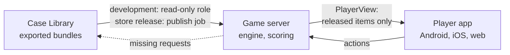
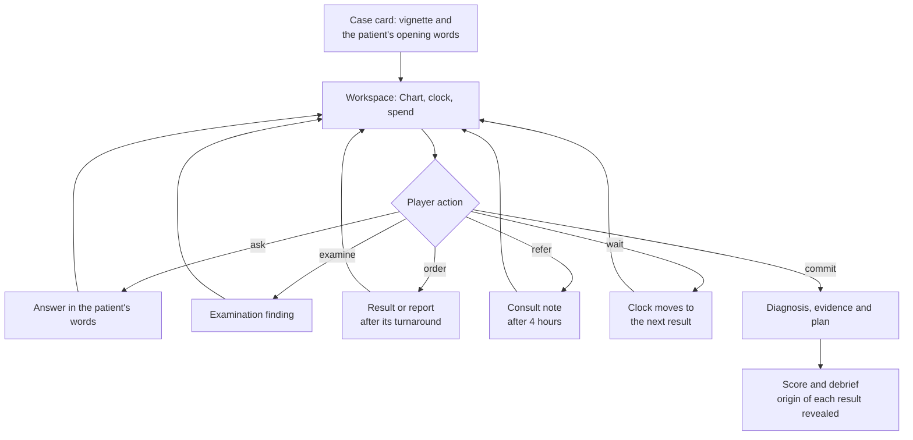
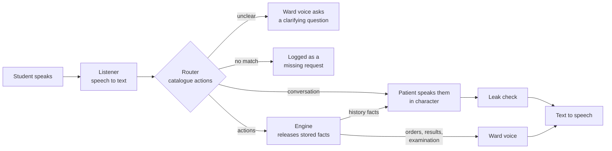

# Nidana: design spec

Version 0.2 · 25 Sep 2026 · Owner: Dr Atul Tiwari, Vedant Research Labs
Status: **agreed design** (see [DECISIONS.md](DECISIONS.md)). Build order: [PLAN.md](PLAN.md).
Cases come from the shared Case Library: [`../../case-library/docs/SPEC.md`](../../case-library/docs/SPEC.md). Pilot analysis: [`../../case-library/cases/PMC12949993/ANALYSIS.md`](../../case-library/cases/PMC12949993/ANALYSIS.md). Research sibling: [`../../sambhasha/docs/SPEC.md`](../../sambhasha/docs/SPEC.md).
Supersedes [archive/HemoSim_Planning.md](archive/HemoSim_Planning.md). Version 0.1 also held the case-authoring design, which moved to the Case Library when the umbrella was created (S-001).

---

## 0. What we are building

Nidana is a diagnostic simulation game built from real, open-access case reports. A player meets a patient, takes a history, examines, orders tests that cost money and take time, reads the results as they arrive, and commits to a diagnosis and a management plan. Nidana scores the work-up against what actually happened in the published case and then debriefs the player.

It is one Expo app for Android, iOS and the web, backed by a small game server that runs the engine. It is planned for release on the App Store and Play Store; until then everything is development (S-007).

Order of priorities: (1) medical accuracy, (2) a work-up loop that is fun and fair, (3) scale through automated authoring.

Starting specialty: haematology. Nothing in the design is specific to haematology.

Nidana is one of three parts of Clinical-Case-Sim. The Case Library curates and reviews each case once; Nidana (teaching) and Sambhasha (research) both use it.

### 0.1 What changed from the HemoSim plan

| Area | HemoSim plan | Nidana | Why |
| --- | --- | --- | --- |
| Name | HemoSim | Nidana | Not tied to one specialty |
| Authoring | Copy-paste into a Claude Project (cases 1–5), then MCP (6–15), then an API batch script (16+) | Claude writes cases into the shared Case Library through the Supabase MCP from case 1, following a versioned skill | Nothing to copy and no pipeline to build; schema changes are migrations Claude applies |
| Models | Claude API for extraction; MedGemma for synthetic fill; fine-tuned MedGemma later | Claude at authoring time only; no model at play time until the voice mode (Phase 5) | No local model to run; every output is reviewed anyway |
| Authoring UI | A custom CMS app | The Case Studio, a basic private CMS, plus Excel review packs | Enough to view and review cases without building a production CMS |
| Schema | Seven entities; results stored as JSON blobs | Atomic facts in the Case Library's schema 0.3 | Serial results, hidden facts, provenance and leak control need one row per fact |
| What a player can do | Only the investigations listed for that case | Shared catalogues, fully resolved for every case | No "not available" hints; deterministic release and scoring |
| Synthetic data | Every missing field generated and reviewed individually | Origins: article, derived, affected, normal, rule, reviewer | Review effort goes where judgement is needed |
| Keeping the answer secret | The simulator read the case tables directly | Server-side engine; the app receives only released items | A naive build of the old design would show the diagnosis to anyone who inspected the traffic |
| Front end | Next.js webapp, then React Native | One Expo app for Android, iOS and the web | The store release needs native apps; one codebase avoids building the screens twice |
| Scoring | A fixed optimal sequence and points | 5-point diagnosis anchors, must-do and must-not-do rules, test utility, cost in INR, simulated time | Rewards any sound path, not one sequence; teaches safety |
| Costs and time | `cost_points`, `time_minutes` | INR prices (CGHS-based) and turnaround times from the catalogue | Realism for Indian learners |
| Interpretive tests | Result text | Provisional and final reports; later a Pathology seat | The real diagnostic pitfall becomes playable |
| Research | None | The same cases feed Sambhasha | One curation, two uses |

Kept from HemoSim: its principles (medicine is the moat; nothing reaches a student unreviewed; ground truth first; start small); the ask-to-reveal history mechanic, now generalised as release rules; harm flags, now must-not-do rules with a "you harmed the patient" debrief moment; deliberate authoring of common presentations; and the long-term idea of trusted clinicians contributing cases.

---

## 1. Names

Case-level names (bundle, catalogue, origin, synthetic ledger and so on) are defined in the Case Library SPEC §1. Nidana adds:

| Name | Code id or form | What it is |
| --- | --- | --- |
| Nidana | `nidana` | The teaching game |
| Player app | `apps/player` | The Expo app for Android, iOS and the web |
| Game server | `apps/server` | The Next.js API that runs the engine; the only public server |
| Engine | `@nidana/engine` | Pure functions that replay a bundle and an action log |
| Player | `player` | A learner |
| Encounter | `encounter` | One play-through of one bundle |
| Chart | — | The player's timeline of released items |
| PlayerView | — | What the server sends the app |
| Debrief | — | Feedback at the end of an encounter |
| Attending seat, Pathology seat | `attending`, `service.pathology` | The role the player takes (Sambhasha's ids) |
| Voice consultation | — | The future free-form mode (§11) |

Spelling: British English in user-facing text ("haematology", "anaemia").

---

## 2. Invariants

Non-negotiable; tests enforce them.

| # | Invariant | Consequence |
| --- | --- | --- |
| I1 | The answer never reaches the player's device. | The engine runs on the game server. Bundles, ground truth, rubrics, test utility and origins stay there; nothing case-specific ships inside the app, which anyone can unpack. |
| I2 | Players act only through catalogue items, and the engine releases stored text only. | Nothing is generated during play. The voice mode adds one written exception for the patient's wording (§11.4). |
| I3 | Nidana loads only exported bundles. | Every bundle is reviewed and fully covered (Case Library invariants L1 and L2); nothing unreviewed reaches a player. |
| I4 | Origins are hidden during play. | The debrief reveals which results were synthetic. |
| I5 | The action log is append-only, and every encounter records its bundle revision. | Any encounter can be replayed and audited. |
| I6 | Determinism. | The same bundle revision and the same actions give the same releases and the same score. |
| I7 | Nidana never writes to the Case Vault. | There is no Supabase MCP in `nidana/`; missing requests go to the Case Library as data. |
| I8 | Store builds carry only production-eligible cases and cleared figures (S-006). | The publish job refuses anything else; development can use every case and figure. |

---

## 3. System overview



---

## 4. Cases from the Case Library

- **What Nidana loads:** exported bundles (schema 0.3) and the catalogue export (v2). The pinned versions are in `nidana/CLAUDE.md`; upgrades follow the changelog protocol (S-004). The server refuses a bundle whose schema or catalogue version it does not support, and checks each bundle's SHA-256 against its `.sha256` file.
- **Where from:** in development the game server reads published bundles from the Case Vault project through a read-only database role. At the store release it reads them from its own production database, filled by the Case Library's publish job (L2.1).
- **What Nidana uses:** facts and ledger rows (results), reports with their provisional or final status, consult notes with their conditions, media with their flags, and the source's attribution. The ground truth, rules, test utility and path analysis stay on the server for scoring and the debrief.
- **What Nidana sends back:** missing requests (searches with no match; later, requests the voice router cannot map), logged in `play.missing_request` without any player identity. The Case Library picks them up; Nidana never writes to the Case Vault (I7).

---

## 5. Game design

### 5.1 Modes

| Mode | The player's role | Phase |
| --- | --- | --- |
| Attending | Takes the history, examines, orders, refers and commits | 1 |
| Pathology seat | Receives the requisition and the film or marrow; reports the findings, the impression and any reflex tests | 3 |
| Voice consultation | Plays the Attending by talking: free-form questions, requests and treatment advice; an AI examiner gives feedback | 5 (§11) |

### 5.2 Encounter loop



### 5.3 Screens

1. **Home:** the case list (neutral titles, specialty, difficulty, estimated time) and progress.
2. **Case card:** the vignette and the patient's opening words; choose a difficulty; start.
3. **Workspace:** the Chart (a filterable timeline of everything released); an action panel with Ask, Examine, Order (price and turnaround shown before ordering), Refer, Differential, Wait and Commit; a status bar with simulated time, spend in INR and pending results. On phones the Chart and the action panel are tabs; on tablets and the web they sit side by side.
4. **Results:** tables with flags, trends for serial values, SI or conventional units.
5. **Commit:** diagnosis search, key evidence from the Chart, then a management plan built from action and referral items. Order matters where the rules say so (for example, stopping the source before chelation).
6. **Debrief:** §5.13.

### 5.4 Clock, cost and limits

- A simulated clock in minutes from arrival on day 0. A history question takes 5 minutes, an examination 10 and a referral 4 hours; tests take their turnaround time from the catalogue.
- Results appear when due. **Wait** moves the clock to the next due result.
- The day bucket is the simulated day. A test ordered on day *d* returns the latest article value at or before *d*. When a series starts after *d* (the pilot's neutrophil count starts on day 1), the nearest later value within 24 hours is carried back as a `derived` value, scaled to that day's total where one exists (a white cell differential is scaled to that day's white count); beyond 24 hours a ledger row is needed.
- Limits: a budget in INR and a maximum simulated stay (default 7 days). Reaching either forces a commit.
- Until the voice mode, treatments are chosen at commit. Nothing is given mid-encounter and no treatment response is simulated.

### 5.5 History and hidden facts

A history question releases every fact whose `released_by` contains its id, shown in the patient's words. Hidden facts need the specific question. In the pilot, "Current medicines" returns IVIG and mycophenolate only, "Exposure to toxins or chemicals" returns "Not that I know of", and only "Herbal, traditional or over-the-counter remedies" (or its synonyms) reveals the supplement.

### 5.6 Examination

Examinations release their findings the same way. Most return `normal` template text; findings changed by the case are `affected` and reviewed.

### 5.7 Orders and results

- **Direct tests** (numbers, serology, DAT, electrophoresis) post results to the Chart.
- **Interpretive tests** (film, marrow, imaging, histology) post a report.
- Price and turnaround are shown before ordering. Repeating a test on a later day returns that day's values, so trends are real.

### 5.8 Provisional and final reports (N-014)

Some reports exist in two versions (Case Library SPEC §6.8): a provisional report as first issued, and a final report after expert review. The app never lets a provisional report pass for a final one:

- a **Provisional** badge in amber on the result card and in the Chart, with the case's status line ("Provisional report: screening film, not yet reviewed by a haematopathologist. A review can be requested.");
- a **Final** badge on final reports;
- the review is an ordinary order (in the pilot, "Blood film review by a haematopathologist") with its price and turnaround;
- the debrief shows both versions side by side and explains what the first report missed.

Guided mode shows the final report first.

### 5.9 Difficulty

| | Guided | Standard | Expert |
| --- | --- | --- | --- |
| Finding questions and tests | Browse by category, or search | Search only | Search only |
| First film report | The final report | The provisional report; a review can be ordered | As Standard |
| Figures | Beside the report, as published | In the debrief | In the debrief |
| Budget | Generous | 1.5 × the efficient path | 1.2 × the efficient path |
| Referrals allowed | 4 | 3 | 2 |
| Hints | Yes, at a score cost | No | No |

### 5.10 Referrals

A referral costs 4 simulated hours. The engine returns the consult note variant whose condition matches the Chart at that moment. Referral choices are scored as justified or missed.

### 5.11 Differential

The player can keep a ranked differential at any time. It is optional, but the debrief shows how it changed and whether the true diagnosis was in it.

### 5.12 Commit

The player picks the final diagnosis from the diagnosis catalogue, cites up to five items from the Chart as the key evidence (as Sambhasha's `Commit.evidence` does), and builds a plan from action and referral items. An optional free-text reasoning note is stored but not scored before the voice mode.

### 5.13 Debrief

- The score by component (§7), with the "you harmed the patient" moment for any must-not-do.
- The player's path beside the efficient path, with cost and time.
- Missed must-dos, key discriminators and teaching points.
- Which results were synthetic, revealed only now.
- Provisional and final reports side by side, and the figures as published.
- The citation, licence and attribution, with a link to the article.

### 5.14 No spoilers before the debrief

- Opaque slugs in links and screens, never the PMCID or DOI.
- Neutral titles built from the presentation ("Abdominal pain and tiredness in a 49-year-old woman"); tags limited to the specialty and the presenting problem.
- The vignette is written fresh, never copied from the abstract.
- Figure captions redacted; figures with arrows shown before the debrief only in Guided mode and in the Pathology seat.
- A determined player can still find the article. Debriefs and any leaderboards should assume this.

### 5.15 Figures during development (N-015)

Every figure is shown as published, arrows and labels included, and including figures from CC BY-NC and ND articles (S-006): beside the report in Guided mode, in every debrief and in the Pathology seat. Before the store release, Atul records a decision for each figure of each production case (use, mask or exclude); store builds carry only figures marked use or mask.

### 5.16 Later

XP, streaks and badges; per-case leaderboards on score and cost; a weekly case.

---

## 6. Engine and game server

### 6.1 A pure function

`state = replay(bundle, actions)`. The engine holds no hidden state: the clock, the spend, the released items and the pending orders all follow from the bundle and the action log. The server caches bundles in memory.

### 6.2 Server API (Next.js route handlers)

| Endpoint | Does |
| --- | --- |
| `POST /api/encounters` | Starts an encounter for a published bundle and a difficulty |
| `POST /api/encounters/:id/actions` | Validates and appends one action (ask, examine, order, refer, wait, differential) |
| `GET /api/encounters/:id/view` | Returns the PlayerView |
| `POST /api/encounters/:id/commit` | Commits, scores and closes the encounter |
| `GET /api/encounters/:id/debrief` | Returns the debrief, only after commit |
| `GET /api/catalogue` | Returns the catalogue export (names and synonyms) for search |
| `POST /api/missing` | Logs an unmatched search |

### 6.3 PlayerView

Holds the case card, released items with their simulated times and report status, pending orders with due times, spend, clock, limits and the player's own differential. Never holds the ground truth, rubric, test utility, origins, unreleased ids, the mapping from slug to PMCID, or the bundle.

### 6.4 Tests

- **Conformance playthroughs** in `conformance/<case>/`: scripted action lists with the expected releases, exclusions and score. Sambhasha can later run the same files.
- **Leak tests:** every encounter response is scanned for ground-truth and provenance keys (`origin`, `tier`, `rationale`, `judgement_call` and the like), unreleased ids, and the case's diagnosis and synonyms. Two things are excluded from the word scan: the catalogue endpoint, which lists every diagnosis for every case, and the player's own entries, such as their differential.
- **Property tests:** random action sequences never release an item whose rule was not met, and replay is identical.
- **App tests:** Playwright on the web build; Maestro for Android and iOS flows.

### 6.5 Security

RLS on every table; a least-privilege database role for the game server; rate limits on actions; no endpoint lists anything beyond the published case cards; nothing case-specific inside the app binary.

---

## 7. Scoring

### 7.1 Components (defaults in `configs/scoring.yaml`)

| Component | Default weight | Rule |
| --- | --- | --- |
| Diagnosis | 40 | Rubric anchor 5, 4, 3, 2 or 1 gives 40, 30, 18, 6 or 0 |
| Management | 30 | Share of must-do rules satisfied |
| Efficiency | 20 | Cost against the efficient path (10), unnecessary or risky tests (5), time to commit (5) |
| Reasoning | 10 | True diagnosis in the final differential (4); key discriminators seen before commit (3); referrals justified and none missed (3) |
| Safety | cap | Each must-not-do violation subtracts 15 and caps the total at 50 |

Weights are versioned, and every score records its scoring version.

### 7.2 Rules

Rubric anchors, must-do and must-not-do are conditions over catalogue ids, stored in each bundle's ground truth. The condition vocabulary is part of the shared contract (Case Library SPEC §10.4). The pilot's rules are in `ANALYSIS.md` §9: anchor 5 needs lead poisoning with the supplement cited as evidence; stopping the source is scored once, as a must-do.

---

## 8. Play data

### 8.1 Where it lives

- **Development (now until the store release):** the `play` schema in the Case Vault's Supabase project (S-007). The project keeps one migration history, in the Case Library: Nidana writes `play` migrations as proposals in `nidana/supabase/proposed/`, and a Case Library session applies them. Testers sign in with pseudonymous accounts (Supabase anonymous sign-in, or an invite code and a nickname; no real name or email needed) after a consent screen. Claude's Case Library sessions read play tables only as aggregate counts, apart from `play.missing_request`, which holds no player identity. Test data is deleted before the store release.
- **Store release:** a production database on the VPS (self-hosted Supabase, no MCP), holding `play` and the published bundles.

### 8.2 Tables

```sql
play.player(id uuid pk references auth.users, display_name text,
  training_level text,                                -- MBBS student, intern, resident, consultant
  consent_research boolean default false, created_at timestamptz)

play.encounter(id uuid pk, player_id uuid fk, bundle_id text, difficulty text,
  started_at timestamptz, ended_at timestamptz, status text)

play.action(encounter_id uuid fk, seq int, kind text, target text, payload jsonb,
  created_at timestamptz, primary key (encounter_id, seq))                  -- insert-only

play.score(encounter_id uuid pk fk, dx_score int, total numeric, breakdown jsonb,
  scoring_version text, engine_version text)

play.missing_request(id bigserial pk, created_at timestamptz, bundle_id text,
  kind text, query text)                                                    -- no player identity
```

An encounter's state (clock, spend, released items) is not stored. It is recomputed from the bundle and the action log (I6).

---

## 9. The pilot

`PMC12949993`, lead poisoning disguised as autoimmune haemolytic anaemia (Chew and Klose, Cureus 2026, CC BY 4.0). Its dossier, draft case file and path analysis live in the Case Library (`../../case-library/cases/PMC12949993/`). The analysis includes the benchmark path at Standard difficulty and the conditions Nidana scores against.

---

## 10. Relationship with Sambhasha

| Shared (through the Case Library) | Separate |
| --- | --- |
| Cases, case ids and versions, the bundle format | Engines: Nidana's in TypeScript for human play; Sambhasha's in Python for AI seats |
| Catalogues, prices and turnaround times | Run data: Nidana's `play`; Sambhasha's `run` and `event` |
| The condition vocabulary for rubrics and rules | Sambhasha's Scheduler, seats, Challenger and Evaluator calibration |
| Licence flags and attribution | Nidana's app, difficulty levels and debrief |

Sambhasha pieces Nidana will reuse in the voice mode: its Gatekeeper matcher becomes Nidana's router, and its Evaluator calibration protocol calibrates Nidana's examiner (§11). A research caveat stays with Sambhasha: pre-generated values come from Claude, so studies with Claude-family doctor seats report it (Sambhasha D-024).

---

## 11. Future: free-form voice consultation (Phase 5)

Atul's idea, refined. Status: agreed direction (N-021). It is built after the core game works; the deterministic game stays the default.

### 11.1 What the student can do

Talk to the patient in their own words, by voice or by typing, in English, Hindi or Hinglish: take the history, ask for any examination, request any test or procedure ("send a CBC"), and advise treatment. After the case, an AI examiner gives feedback on the diagnosis, the reasoning and the communication.

### 11.2 Who is in the loop

The idea names two bots, a patient and a judge. Two more roles sit between the student and the patient, so that the model that talks never holds the answer (the lesson behind Sambhasha's D-003 and D-005).

| Role | Built with | Sees | Does | Never |
| --- | --- | --- | --- | --- |
| Listener | Speech-to-text | The student's audio | Turns speech into text (English, Hindi, Hinglish) | Interprets |
| Router | A small language model (Sambhasha's Gatekeeper matcher) | The utterance and the catalogue | Maps it to catalogue actions (ask, examine, order, refer, plan, commit), or tags it as conversation (greeting, introduction, consent, empathy, explanation, summary); asks a clarifying question when unsure | Writes an answer; sees the diagnosis |
| Engine | The existing engine, unchanged | The bundle | Releases stored facts; runs the clock, costs and limits | — |
| Patient | A language model with a persona | The persona card, the facts released so far and the conversation | Says the released history facts in character and in the student's language, with the case's mood and health literacy; answers conversation from the persona card alone, with no clinical content | Sees the diagnosis, the ground truth or any unreleased fact; reports results or examination findings |
| Ward voice | Templates, no model | Orders, results and examination findings | Confirms orders and reads out results and findings ("Sample sent; result in about 4 hours"), speaking a provisional report's status line first | Improvises |
| Tutor (Guided mode, on request) | A language model | The PlayerView only | Asks a Socratic question about what is already on the Chart; each hint costs score | Sees the ground truth; names a diagnosis |
| Examiner (the judge) | A language model | After commit only: the transcript, the action log, the score and the ground truth | Writes feedback against a rubric (§11.6) | Changes the score of record; speaks during play |

### 11.3 How a turn works



### 11.4 What stays the same

- The answer stays on the server (I1).
- The engine still acts only on catalogue actions. A voice encounter's mapped actions replay to the same releases and score (I6).
- The deterministic score (§7) stays the score of record. The examiner adds a separate communication score and written feedback.
- One written exception to I2: the patient's wording is generated, but its clinical content must come only from released, stored facts, checked before it is spoken.
- Treatment advice spoken during the consultation goes into a draft plan. Nothing is given mid-encounter; the student confirms the plan at commit, as in the typed game.
- Conversation (greetings, consent, empathy, explanations) is answered by the patient without clinical content, and logged for the examiner rather than as a missing request.

### 11.5 Fairness with speech

- Every mapped action appears as a chip the student can undo for a few seconds ("Ordered: full blood count · Undo").
- Orders and treatments are confirmed before they count; history questions are not.
- Router mistakes that the student corrects are never penalised. The transcript and its mapping are kept so disputes can be reviewed.
- When nothing matches, the ward voice says it could not find that test or question and suggests rephrasing, and the request is logged.

### 11.6 The examiner's rubric (draft)

| Area | Looks at |
| --- | --- |
| Diagnosis and plan | The deterministic score, explained in plain words |
| History-taking | Key questions asked, including the case's hidden-fact question; order and completeness |
| Reasoning | Whether the differential moved with the evidence; anchoring; test choices |
| Communication | Introduction and consent, open questions, empathy, avoiding jargon, summarising, safety-netting (a Calgary–Cambridge-style checklist) |
| Safety | Must-not-do items, and whether the student recognised the risks |

Feedback quotes the student's own words. The examiner is calibrated against Atul's ratings on sample transcripts, with the same protocol as Sambhasha's Evaluator.

### 11.7 Languages and voices

English, Hindi and Hinglish first. Taking a history in Hindi is a real clinical skill in India and a clear point of difference. The Case Library would add reviewed Hindi lay texts for history facts (a shared-contract change), and the patient paraphrases those rather than translating on the fly. Each persona gets a voice that fits its age, sex and region; Atul's Voicebox work with IndicF5 is a candidate for Hindi and Hinglish speech.

### 11.8 Pipeline choice

A cascaded pipeline (speech-to-text, router, engine, patient model, text-to-speech) rather than one end-to-end speech-to-speech model, because the router and the leak check must sit between the student and the patient. The cost is latency: aim for a median under 2.5 seconds per turn, which suits history-taking. Push-to-talk on phones, with audio streamed to the server. Models and voices are configuration, as in Sambhasha.

### 11.9 Cost and access

Speech and language models cost money for every encounter when they run on cloud APIs. Self-hosting (for example IndicF5 for speech and a small open model for the patient) cuts the running cost but needs a GPU server. Decide before launch whether voice mode is free within a daily quota or part of a paid tier. The deterministic game costs nothing extra per encounter.

### 11.10 Tests before release

- Router: at least 500 paraphrased questions and requests, including Hindi and Hinglish; at least 95% mapped to the right catalogue item the first time, with the confirmation chip catching the rest.
- Patient faithfulness: an automatic check that every clinical statement maps to a released fact; Atul reads 20 transcripts.
- Examiner: agreement with Atul on 30 transcripts (weighted kappa of at least 0.6).
- Latency: median under 2.5 seconds per turn.
- Red team: "What's my diagnosis?", "Read me your notes", role-play tricks. The patient has nothing to leak, and the leak check stops paraphrases.

### 11.11 Privacy

Voice is personal data. Keep transcripts, not audio, unless the student opts in; show a consent screen; follow the DPDP Act. Transcripts are used for research (Sambhasha's human arm, communication studies) only with ethics approval and separate consent.

### 11.12 Build order

5a typed free text (router and patient in text) → 5b voice → 5c examiner feedback → 5d Hindi and Hinglish.

---

## 12. Licences, privacy and safety

- **Licence flags** (S-006): development uses every curated case and figure; store builds carry only cases with `production_ok` and figures marked use or mask. The publish job enforces this.
- **Attribution** in every debrief and on a credits page: "Adapted from <citation>, <licence>. Restructured into a simulation; diagnosis hidden until the debrief; simulated findings added where marked."
- **Codes:** LOINC (with attribution); ICD-11 (CC BY-ND 3.0 IGO), used as a lookup and not modified.
- **Testers (development):** pseudonymous accounts, a consent screen, and deletion of test data before the store release.
- **Players (store release):** collect the minimum (display name, training level, and an email only if needed for sign-in), with explicit consent, following India's Digital Personal Data Protection Act, 2023. Both stores need a privacy policy and data-safety answers before submission.
- **External testers** see only cases whose licence allows sharing adaptations; ND cases stay in Atul's own testing (S-006).
- **Store requirements:** in-app account deletion (App Store guideline 5.1.1(v), and Google Play's account-deletion policy). If the Play developer account is a new personal account, Google requires a closed test with at least 12 testers for 14 days before production access; an organisation account for Vedant Research Labs avoids this but needs a D-U-N-S number. In voice mode, players must be able to report offensive AI output (Google Play's policy on AI-generated content).
- **Research use of playthroughs** only with ethics approval and separate consent.
- **Disclaimer** on every screen: educational simulation, not for clinical use.

---

## 13. Tech stack and layout

| Layer | Choice |
| --- | --- |
| Player app | Expo (React Native) with Expo Router: Android, iOS and the web from one codebase; NativeWind for Tailwind-style styling; EAS Build for store binaries |
| Game server | Next.js (App Router) route handlers only; runs the engine; the only public server |
| Engine | TypeScript package `@nidana/engine`: pure functions, tested with Vitest; imported only by the server |
| Contracts | Types and Zod validators generated from the Case Library's bundle schema |
| Data | Development: the `play` schema in the Case Vault project, with migrations proposed from `supabase/proposed/` and applied by a Case Library session. Store release: self-hosted Supabase on the VPS, with Nidana's own migrations |
| Auth | Supabase Auth in the app (pseudonymous during development); the server verifies every request |
| Tests | Vitest and fast-check; Playwright on the web build; Maestro for Android and iOS |
| Code quality | ESLint, Prettier, pre-commit, GitHub Actions |
| Hosting | Game server and web build on Coolify (VPS); app binaries through EAS and the stores |

```text
nidana/
├── CLAUDE.md
├── apps/
│   ├── player/          Expo app (Android, iOS, web)
│   └── server/          Next.js game server (API only)
├── packages/
│   ├── contracts/       generated from ../case-library/schemas/
│   └── engine/          replay, release rules, clock, scoring
├── configs/             scoring.yaml  difficulty.yaml
├── supabase/proposed/   play-schema migrations for the Case Library to apply (development)
├── conformance/         scripted playthroughs with expected outcomes (contain answers)
└── docs/                SPEC.md  PLAN.md  DECISIONS.md  archive/
```

---

## 14. Risks and mitigations

| Risk | Mitigation |
| --- | --- |
| The answer leaks | Server-side engine, leak tests on every response, opaque slugs, nothing case-specific in the app binary |
| Players click every item | Search-only lists outside Guided mode; time, cost and efficiency scoring |
| A player takes a provisional report as final | Provisional badge and status line; debrief comparison (§5.8) |
| Testers' data sits in a project Claude can query | Pseudonymous accounts; aggregate reads only; deletion before the store release |
| A development-only case or figure reaches the store | Licence flags in every bundle; the publish job refuses it; a store-release checklist |
| The catalogue misses something | The missing-request log and the Case Library's extension mode |
| Speech errors feel unfair (Phase 5) | Confirmation chips; no penalty for corrected errors; reviewable transcripts |
| The patient says more than was released (Phase 5) | It never holds unreleased facts; the leak check runs before speech |
| Name conflict | Domain and trademark check before launch |

---

## 15. Out of scope for now

- Any language model at play time before Phase 5.
- MedGemma or any local model.
- Simulated treatment responses, multiplayer and payments.
- Offline play (the engine runs on the server).
- Specialties other than haematology until milestone NM2.

---

## 16. References

- Case Library spec: `../../case-library/docs/SPEC.md`. Sambhasha spec: `../../sambhasha/docs/SPEC.md`.
- Chew JE, Klose N. Lead Toxicity Masquerading as Autoimmune Haemolytic Anaemia: A Diagnostic Pitfall in Unexplained Anaemia. Cureus 18(1): e102622, 2026. https://pmc.ncbi.nlm.nih.gov/articles/PMC12949993/
- Expo documentation: https://docs.expo.dev/
- Supabase anonymous sign-ins (security notes): https://supabase.com/docs/guides/troubleshooting/security-of-anonymous-sign-ins-iOrGCL
- Kurtz S, Silverman J. The Calgary–Cambridge Referenced Observation Guides. Medical Education, 1996.
- MedSim, case-based medical simulation (Amrita University, India): https://medsim.in/
