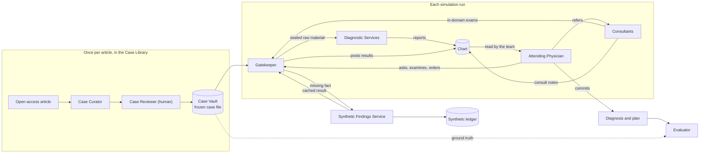
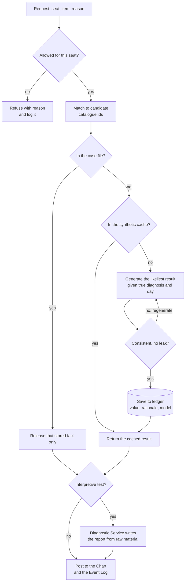
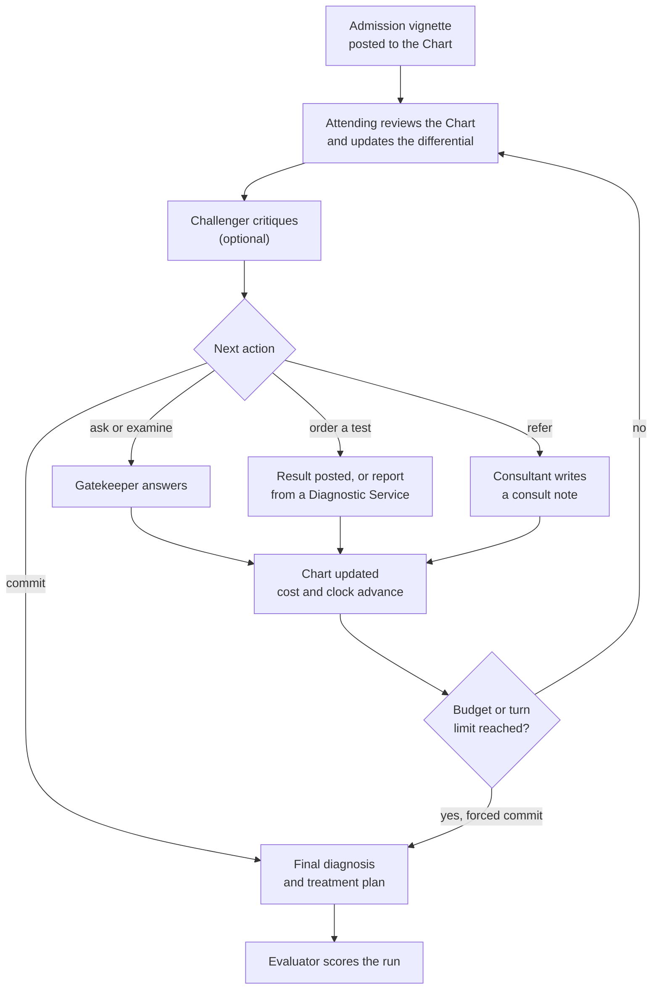
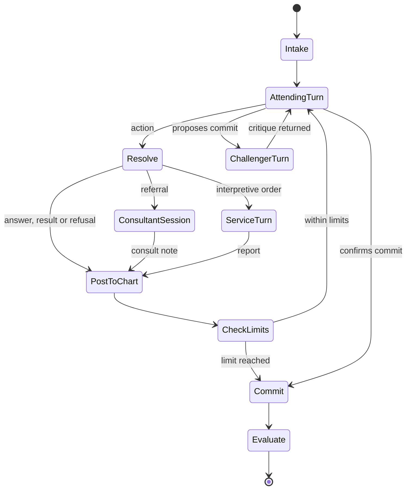
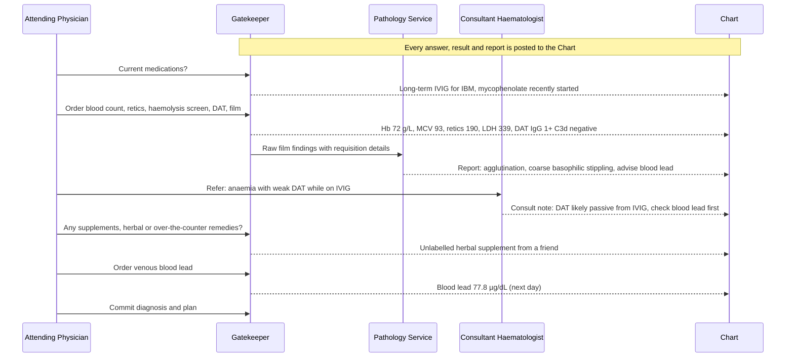

# Sambhasha: design spec

Version 0.3 · 25 Sep 2026 · Owner: Dr Atul Tiwari, Vedant Research Labs
Status: **decisions final** (see [DECISIONS.md](DECISIONS.md)). Build order: [PLAN.md](PLAN.md). Pilot case: [`../../case-library/cases/PMC12949993/`](../../case-library/cases/PMC12949993/PILOT_CASE.md).
Supersedes [archive/virtual-diagnostic-team-spec-v0.1.md](archive/virtual-diagnostic-team-spec-v0.1.md).

> **What changed in 0.3 (25 Sep 2026).** The project is renamed Sambhasha (formerly the Virtual Diagnostic Team, VDT; D-026) and is one part of Clinical-Case-Sim. Cases come from the shared Case Library as bundles (schema 0.3), so §9 now covers import only (D-021). The Gatekeeper's matcher chooses among catalogue ids (§7, D-022). Results for catalogue items are pre-generated and reviewed in the Case Library, and the Synthetic Findings Service answers only requests outside the catalogue (§8, D-023). Prices and turnaround times come from the catalogue (§10.4). Study case sets follow the licence flags (§15, D-025). The teaching game is Nidana (§16, D-027). Code ids change from `vdt` to `sambhasha`.

---

## 0. What we are building

A sequential-diagnosis simulator built from open-access, published case reports. A team of seats works up a hidden case step by step: an Attending Physician, Consultants and Diagnostic Services. The Gatekeeper releases facts only when a seat asks, examines or orders. The Synthetic Findings Service fills gaps the article never reported. The Evaluator scores the result against the published ground truth.

Order of use: (1) research simulation and benchmark, (2) publication. The teaching game is Nidana, a separate part that uses the same cases (D-027).

The name comes from *sambhāṣā*, the Charaka Saṃhitā's term (Vimāna Sthāna 8) for structured discussion among physicians: friendly consultation (*sandhāya*) and challenging debate (*vigṛhya*), which match the Consultants and the Challenger.

Out of scope: clinical decision support, real patient data, simulated outcomes of alternative treatments in research mode, and Hermes Agent (see §18).

Closest prior work: Microsoft AI's MAI-DxO and SDBench (arXiv 2506.22405, 2025), whose Gatekeeper reveals facts only on explicit request and synthesises results for tests missing from the case. Sambhasha adds referral to Consultants mid-work-up, Diagnostic Services that report only on orders from raw material, a cached and replayable synthetic ledger, licence-filtered open-access cases, and human-swappable seats.

---

## 1. Names

Use these names exactly in code, prompts, logs and documents.

| Name | Code id | What it is | Replaces (first idea) |
| --- | --- | --- | --- |
| Case Curator | `curator` | Offline, in the Case Library: Claude turns an article into a draft case (D-021) | Judge, reading the article |
| Case Reviewer | `reviewer` (human) | Verifies and freezes each case, in the Case Library | — |
| Case Vault | — | The shared store of frozen, versioned cases (Supabase project `case-vault`), exported as bundles | "Tabular database" |
| Gatekeeper | `gatekeeper` | Releases stored facts on request and enforces access | Judge, answering questions |
| Synthetic Findings Service | `synthetic` | Fills gaps with the likeliest result, given the truth | Expert "medical Wikipedia" bot |
| Evaluator | `evaluator` | Scores a run after it ends | Judge, deciding the result |
| Attending Physician | `attending` | Leads the work-up; the only seat that orders, refers and commits | Bot-1 |
| Challenger | `challenger` | Argues against the leading diagnosis | — |
| Consultant | `consultant.<specialty>` | e.g. `consultant.haematology`; examines within its domain, advises | Speciality bots |
| Diagnostic Service | `service.<department>` | `service.pathology`, `service.radiology`, `service.microbiology`; reports only on orders | Pathology bot |
| Patient | `patient` | Not used in research runs. Nidana's voice mode has its own patient (Nidana SPEC §11) | — |
| Scheduler | `scheduler` | Decides which seat acts next | — |
| Chart | `chart` | The shared record: a view over released events | "Shared information" |
| Event Log | `event_log` | Append-only record of every request, answer, message and model call | — |

Spelling: British English in user-facing text ("haematology"). Code ids exactly as above.

---

## 2. Invariants

These are non-negotiable. Tests enforce them.

| # | Invariant | Consequence |
| --- | --- | --- |
| I1 | The information barrier lives in data and code, never in prompts. | No seat has file, database, web or code-execution tools. A seat sees only the view the engine builds. |
| I2 | The Scheduler decides who acts next. Models never do. | Deterministic turn order; reproducible transcripts. |
| I3 | Every seat can be an LLM or a human with an identical view. | `Seat.act(view) -> Action` is the only seat interface. |
| I4 | The Gatekeeper selects stored text. It never writes its own. | Its model returns candidate catalogue ids only (D-022); released words come from the case bundle or the ledger. |
| I5 | One missing-fact rule: the likeliest result for this patient, given the true diagnosis and the day. | Cached and ledgered. Never "not available". Never flagged as synthetic during play. |
| I6 | Append-only Event Log; clean state for every run. | Runs replay and audit. No memory carries over between runs. |
| I7 | Frozen case files are immutable. | Any change creates a new version (`PMC12949993@v2`). |
| I8 | The ground truth never enters any seat's view. | Only the Synthetic Findings Service (during a run) and the Evaluator (after it) read it. |

---

## 3. System overview



The Chart is the only window between the hidden case and the team.

---

## 4. Seats and services

| Seat | Sees | Actions | Default player |
| --- | --- | --- | --- |
| Case Curator (offline, in the Case Library) | The full article | Extract, tag and redact facts; draft the ground truth; pre-generate results | Claude, then Case Reviewer sign-off |
| Gatekeeper | Case file (facts, raw material, media) and synthetic ledger; not the ground truth | Resolve requests, carry out orders, post to the Chart, refuse | Code plus a small matcher model |
| Synthetic Findings Service | Case file including the ground truth; reference ranges | Generate, check, cache and log missing results | LLM from a different family from the doctor seats |
| Attending Physician | The Chart | AskHistory, Examine, OrderTest, Refer, UpdateDifferential, Commit | LLM or human |
| Challenger (optional) | The Chart and the Attending's differential | Challenge | LLM |
| Consultant | The Chart, after referral | AskHistory, Examine (own domain), BedsideTest (own domain), ConsultNote | LLM or human |
| Diagnostic Service | Its order, the requisition's clinical details and the raw material | Report, with optional reflex-test suggestions | LLM (vision in image mode) or a resident |
| Evaluator | Everything, after the run | Score | LLM rubric plus human raters |
| Patient | Not used in research runs (Nidana's voice mode, Nidana SPEC §11) | — | — |

---

## 5. Information model

### 5.1 Case file

Cases arrive as bundles in the Case Library's schema 0.3 (Case Library SPEC §10), which extends the schema 0.2 described here with catalogue links, origins, report status and licence flags. The pilot's hand-made draft in schema 0.2 is [`gold-case-file.draft.json`](../../case-library/cases/PMC12949993/gold-case-file.draft.json). A case file holds:

| Part | Content |
| --- | --- |
| `source` | Citation, DOI, PMCID, licence, date verified, attribution line |
| `clock` | Calendar date of day 0 and its label (usually admission) |
| `vignette` | Two or three sentences the team starts with; no diagnostic content |
| `facts` | History and examination facts, one per row, with release rules |
| `series` | Serial numeric results, expanded to one fact per timepoint at import |
| `single_results` | One-off results: numbers, serology, DAT, electrophoresis |
| `raw_material` | What a Diagnostic Service receives for an interpretive test |
| `media` | Figures with redacted captions and licence |
| `ground_truth` | Final diagnosis, synonyms, accepted differential, red herrings, must-do, must-not-do, rubric anchors, treatment given, outcome |
| `gaps` | Items the article lacks, with generation guidance and review flags |

Every fact carries: `id`, `category`, `item`, optional `code` (LOINC or SNOMED CT), `value`, `unit`, `ref_range`, `flag`, `day`, `kind` (raw or interpretation), `reveals_dx`, `release` and `source_locator`.

### 5.2 Day semantics

`day` is an integer relative to day 0. A request at simulated day *d* returns the latest value at or before *d*. `day: null` means the fact holds at any point in the admission (used when the article gives no date).

### 5.3 Direct and interpretive results

- **Direct results** (numeric chemistry and haematology, serology, DAT, electrophoresis, immunofixation) are posted by the Gatekeeper straight to the Chart.
- **Interpretive results** (blood film, bone marrow, histology, cytology, imaging) go to a Diagnostic Service as sealed raw material with the requisition's clinical details. The service writes the report, which is posted to the Chart.

### 5.4 Release rules

`release` is one of `vignette`, `chart`, `service.<department>` or `never` (ground truth only). A fact may also carry a `release_condition`, which the matcher must satisfy. Example from the pilot: the herbal supplement (H10) is released only when a seat asks specifically about supplements, herbal, traditional or over-the-counter remedies. A generic toxin question returns only "No known toxin exposure" (H09).

### 5.5 The Chart and seat views

Every released item becomes an event with a `visibility` list. The Chart is the set of events visible to the team. A `SeatView` holds:

- the seat's role card;
- the Chart events that seat may see (Consultants only after referral);
- its own earlier notes;
- the limits remaining.

A Diagnostic Service's view holds only its order, the requisition's clinical details and the raw material.

---

## 6. Actions

Every seat returns exactly one action per turn as structured output.

```python
from typing import Literal
from pydantic import BaseModel

class AskHistory(BaseModel):
    question: str

class Examine(BaseModel):
    system: str                    # e.g. "abdomen", "nervous system"
    manoeuvre: str | None = None   # e.g. "gingival margin inspection"

class OrderTest(BaseModel):        # Attending only
    item: str                      # free text; matched to candidate catalogue ids (D-022)
    indication: str                # clinical details written on the requisition
    urgency: Literal["routine", "urgent"] = "routine"

class Refer(BaseModel):            # Attending only
    specialty: str                 # e.g. "haematology"
    question: str

class ConsultNote(BaseModel):      # Consultants
    findings: str
    impression: str
    recommendations: list[str]     # tests or referrals the Attending may act on

class Report(BaseModel):           # Diagnostic Services
    order_id: str
    report_text: str
    impression: str
    suggested_reflex_tests: list[str] = []

class DifferentialItem(BaseModel):
    diagnosis: str
    probability: float
    evidence_for: list[str]        # event ids
    evidence_against: list[str]

class UpdateDifferential(BaseModel):
    items: list[DifferentialItem]

class Challenge(BaseModel):        # Challenger
    critique: str
    alternatives: list[str]

class Commit(BaseModel):           # Attending only
    final_diagnosis: str
    differential: list[DifferentialItem]
    treatment_plan: str
    evidence: list[str]            # event ids that support the diagnosis

# Before scoring, the matcher maps the free text to catalogue ids and logs the mapping (D-022):
# final_diagnosis -> one DX id; treatment_plan -> RX, ACT and REF ids; each Report -> FND ids.
```

The engine answers with `Answer(event_id, text)`. The event's internal `source` (article, synthetic, refusal) is stored in the Event Log and never shown to seats.

### Permission matrix

Stored in `configs/permissions.yaml`.

| Action | Attending | Consultant | Diagnostic Service | Challenger |
| --- | --- | --- | --- | --- |
| AskHistory | yes | yes, after referral | no | no |
| Examine | general examination | own-domain manoeuvres | no | no |
| BedsideTest | no | own domain only | no | no |
| OrderTest | yes | recommend in ConsultNote | suggest reflex tests in Report | no |
| Refer | yes | recommend in ConsultNote | no | no |
| ConsultNote | no | yes | no | no |
| Report | no | no | its own orders only | no |
| UpdateDifferential | yes | no | no | proposes via Challenge |
| Commit | yes | no | no | no |

A manoeuvre catalogue in the same file maps examination manoeuvres and bedside tests to the specialties allowed to perform them.

---

## 7. Gatekeeper



Release rules, adapted from SDBench's physician-written gatekeeper rules:

1. Release only what a clinician could legitimately obtain with the requested action.
2. No impressions, interpretations or hints. Diagnostic Services interpret; the Gatekeeper never does.
3. Interpretive material goes to the Diagnostic Service as raw material. The Chart receives the service's report.
4. Release pathognomonic findings only when the exact confirmatory test is ordered.
5. Refuse vague requests ("any labs?", "tell me everything") with a reason: ask for a specific item.
6. Refuse and log any request for the diagnosis, the article or its source as a protocol violation.
7. Honour `release_condition` exactly (§5.4).
8. Release stored text only. The matcher model returns catalogue ids from a candidate list, never prose.

Matching: normalise the request, look it up in the catalogue's synonyms first (for example "CBC", "hemogram" and "complete blood count" map to one catalogue id), then ask the matcher model to choose among candidate catalogue ids (D-022). Release conditions are lists of catalogue ids. A catalogue item is answered from the bundle; only a request that matches no catalogue item goes to the Synthetic Findings Service, and its text is logged for the Case Library.

---

## 8. Synthetic Findings Service

Since D-023, results for every catalogue item come pre-generated and reviewed in the case bundle (Case Library SPEC §6). This service answers only requests outside the catalogue, with the same rules, and each request it answers is exported to the Case Library as a missing request.

**Inputs:**

- the frozen case file, including the ground truth;
- the patient's state at day *d*: demographics, comorbidities and values already released;
- the requested item and its code;
- the gap guidance, if the item is listed in `gaps`;
- reference ranges.

**Output**, one row in `synthetic_ledger`:

- values with units and reference ranges, or a raw-material narrative for an interpretive test;
- the rationale and a confidence;
- check results for consistency and leakage;
- the generator model, prompt version and timestamp;
- review status.

**Rules:**

- Give the most likely result for this patient, given the true diagnosis, comorbidities and day. A result is normal only when nothing in the truth would change it.
- Be no more diagnostic than real life. Add no incidental findings unless the article implies them.
- Consistency check: no contradiction with any fact or earlier ledger row; units and magnitudes plausible.
- Leak check: no diagnosis name or synonym; nothing pathognomonic unless the exact confirmatory test was ordered.
- Cache key: (case id, code, day bucket). The same request always returns the same row.
- Gaps marked `auto_generate: false` are never generated. The Case Reviewer sets their values.
- Pre-generation happens in the Case Library, where the Case Reviewer reviews it before study runs.
- Use a different model family from the doctor seats.
- Never reveal during play that a result is synthetic. Reveal it in the debrief and in published data.

---

## 9. Case curation (moved to the Case Library)

Since D-021, cases are curated once, in the shared Case Library, and Sambhasha imports them. Claude curates each open-access article into the Case Vault through the Supabase MCP, under the `case-curate` skill; Dr Atul Tiwari reviews it; it is frozen and exported as a bundle (schema 0.3). The steps this section used to describe (identify, licence gate, fetch, extract, redact, draft the ground truth, verify, freeze) are now in the Case Library SPEC §4 and §7, together with the pre-generation of results for every catalogue item (§6).

What stays here:

1. **Import.** `sambhasha case import <bundle.json>` validates the bundle, checks its SHA-256, writes the case tables and records the bundle revision.
2. **Second leak scan.** The importer runs Sambhasha's leak scanner on all seat-facing text, as a second line of defence. Automatic redaction is not enough on its own: CUPCase's automated diagnosis removal still leaked the diagnosis in 14% of cases.
3. **Feedback.** Requests outside the catalogue that the Synthetic Findings Service had to answer are exported as a CSV of missing requests for the Case Library.

---

## 10. Engine

### 10.1 Diagnostic loop



### 10.2 State machine



A consultant session allows up to K actions (history, own-domain examination, bedside tests) and must end with a ConsultNote. The Challenger also runs every N Attending turns if configured.

### 10.3 Seat interface

```python
from typing import Protocol

class Seat(Protocol):
    seat_id: str        # e.g. "attending", "consultant.haematology", "service.pathology"
    def act(self, view: "SeatView") -> "Action": ...

# LLMSeat: model profile, role card (prompts/<seat>.md), JSON-schema output, retry on invalid output
# HumanSeat: waits for CLI input and receives the same SeatView (Nidana is the human-facing game)
```

### 10.4 Limits, clock and costs

Starting defaults, set per study in `configs/`:

- **Budget:** INR per case, from `configs/prices_inr.yaml`, generated from the Case Library's catalogue export (CGHS-based prices; D-022). Unmatched items are priced by an estimator and flagged.
- **Turns:** at most 30 Attending turns.
- **Referrals:** at most 4.
- **Simulated clock:** `configs/turnaround.yaml`, generated from the catalogue export; the defaults below were moved into the catalogue.

| Item | Default turnaround |
| --- | --- |
| History question | 5 min |
| Examination | 10 min |
| Bedside test | 15 min |
| Consultant session | 4 h |
| Routine labs (blood count, renal and liver function) | 4 h |
| Specialised labs (blood lead, flow cytometry, serology) | 24 h |
| X-ray / ultrasound | 1 h / 4 h |
| CT / MRI | 6 h / 24 h |
| Blood film review | 4 h |
| Bone marrow aspirate / trephine | 24 h / 72 h |
| Biopsy histopathology | 72 h |
| Culture | 72 h |
| Molecular test | 7 days |

---

## 11. LLM gateway and model policy

- One module, `sambhasha.llm`, makes every model call through the `openai` Python SDK against OpenAI-compatible endpoints: OpenRouter for cloud models and Ollama for local ones.
- Model ids live in `configs/models.yaml`, per role: attending, challenger, consultant, service, matcher, synthetic, curator, evaluator. Code never hard-codes a model id.
- Policy: the Synthetic Findings Service and the Evaluator use a different model family from the doctor seats wherever possible.
- **Structured output:** send a JSON schema from the Pydantic model when the provider supports it; otherwise use JSON mode, validate and retry up to twice.
- **Determinism:** temperature 0 and a seed where the provider supports them. A record-and-replay cache (`data/llm-cache/`, keyed by a hash of the request) makes reruns identical.
- **Logging:** every call becomes an Event Log row with model, parameters, prompt version, tokens and cost. OpenRouter reports cost per call; Ollama cost is zero.
- **Tests:** a scripted `FakeLLM` returns fixed responses per role and turn. Tests never call a paid API.
- **Prompts:** role cards live in `prompts/<seat>.md` with a version in front matter, and that version is recorded on each call.

---

## 12. Data model (Postgres through Supabase)

The case tables below are filled only by the bundle importer (§9); since D-021 they mirror the Case Library's schema 0.3 (Case Library SPEC §10.2), which adds catalogue links, origins, report status, licence flags and review fields to the columns shown here. The run tables (`run`, `event`, `order`, `score`) are Sambhasha's own.

```sql
source_article(id uuid pk, pmcid text unique, doi text, title text, journal text, published date,
               licence text, licence_verified_at timestamptz, url text, content_hash text, fetched_at timestamptz)

case_file(id text pk,                    -- e.g. 'PMC12949993@v1'
          source_id uuid fk, version int, schema_version text,
          status text check (status in ('draft','verified','frozen')),
          vignette text, day0_date date, verified_by text, frozen_at timestamptz, frozen_hash text)

fact(case_id text fk, id text, category text, item text,
     code_system text, code text, value text, unit text, ref_range text, flag text,
     day int,                             -- null = valid throughout the admission
     kind text check (kind in ('raw','interpretation')),
     reveals_dx boolean, pivotal boolean,
     release text,                        -- vignette | chart | service.<department> | never
     release_condition jsonb,             -- e.g. {"requires_topics": [...]}
     release_text text, source_locator text,
     primary key (case_id, id))

media(case_id text fk, id text, figure text, specimen text, stain text, file_path text,
      redacted_caption text, licence text, raw_fact_id text, primary key (case_id, id))

ground_truth(case_id text pk fk, final_dx jsonb, accepted_differential jsonb, red_herrings jsonb,
             key_discriminators jsonb, must_do jsonb, must_not_do jsonb, rubric_anchors jsonb,
             treatment_given text, outcome text)

gap(case_id text fk, id text, item text, guidance text, review_required boolean,
    auto_generate boolean default true, primary key (case_id, id))

synthetic_ledger(id uuid pk, case_id text fk, code text, day_bucket int, value jsonb, narrative text,
                 rationale text, confidence numeric, checks jsonb, generator_model text,
                 prompt_version text,
                 review_status text,      -- pending | approved | edited | rejected
                 reviewed_by text, created_at timestamptz,
                 unique (case_id, code, day_bucket))

run(id uuid pk, case_id text fk, engine_version text, config jsonb, config_hash text,
    started_at timestamptz, ended_at timestamptz, status text)

event(id bigserial pk, run_id uuid fk, seq int, sim_minutes int, seat text,
      type text,        -- request, answer, refusal, order, result, report, consult_note,
                        -- differential, challenge, commit, llm_call
      payload jsonb, visibility text[],
      source text,      -- article | synthetic | seat | engine  (never shown to seats)
      model text, prompt_version text, tokens_in int, tokens_out int, cost_usd numeric, hash text,
      unique (run_id, seq))

"order"(id uuid pk, run_id uuid fk, ordered_by text, item_text text, code text, indication text,
        route text,     -- direct | service.<department>
        status text, cost_inr numeric, ordered_at_min int, due_at_min int)

score(id uuid pk, run_id uuid fk, rater text, rater_type text, dx_score int, dx_rank int,
      plan_rating text, must_do_hit int, must_not_do_hit int, cost_inr numeric, sim_hours numeric,
      turns int, unnecessary_tests int, referrals_justified int, referrals_missed int,
      safety_flags text[], synthetic_dependence numeric, notes text)
```

- A trigger blocks updates to `fact`, `media`, `ground_truth` and `gap` rows once their case file is frozen.
- `event` is insert-only.
- The Chart is a view over `event` rows whose `visibility` includes the team.
- Storage sits behind a repository interface with two implementations: in-memory for unit tests and Postgres for integration and runs.

Mapping to the earlier seven-entity simulator plan: Case → `case_file`; Patient → vignette plus history facts; Investigation → `fact` plus `order`; DiagnosticPath → `ground_truth`; ScoringRubric → Evaluator configuration; SyntheticDataLog → `synthetic_ledger`; Disease → a reference table of codes and synonyms.

---

## 13. Evaluation

Rubric anchors, must-do and must-not-do are the shared conditions stored in each bundle (Case Library SPEC §10.4), so scores compare with Nidana's. They are evaluated on catalogue ids: the matcher maps the committed diagnosis and plan, and each Diagnostic Service report, to `DX`, `RX`, `ACT`, `REF` and `FND` ids first (D-022). The LLM Evaluator adds the overall plan rating and handles anything the conditions cannot express. Runs that used the out-of-catalogue fallback are flagged and kept out of primary results (D-023).

- **Diagnosis.** SDBench-style 5-point rubric, with case-specific anchors in the ground truth. A score of 4 or more counts as correct.
- **Differential.** Rank of the true diagnosis in the final differential (top 1 and top 3).
- **Plan.** Must-do items hit and must-not-do items violated, plus an overall rating (appropriate, acceptable or unsafe) against current guidelines and the article.
- **Process:**
    - cost in INR, simulated hours and turns;
    - referrals, justified and missed;
    - each test rated essential, supportive, low-yield, unnecessary or risky.
- **Synthetic dependence.** The share of `Commit.evidence` events whose source is synthetic. Runs above a set threshold are flagged.
- **Raters.** The LLM Evaluator scores every run; two clinicians rate a stratified sample. Report Cohen's kappa and pin the Evaluator model, since changing it shifts scores.

---

## 14. Pilot case and worked example

Pilot: `PMC12949993`, lead poisoning disguised as autoimmune haemolytic anaemia (Chew and Klose, Cureus 2026, CC BY 4.0). A woman with inclusion body myositis on IVIG presents with abdominal pain and lethargy. A weak IgG-only DAT and film agglutination point toward warm AIHA. Coarse basophilic stippling, ring sideroblasts, a hidden herbal supplement and a blood lead of 77.8 µg/dL settle it. Full dossier: [`../../case-library/cases/PMC12949993/PILOT_CASE.md`](../../case-library/cases/PMC12949993/PILOT_CASE.md); path analysis: `ANALYSIS.md` in the same folder.

An illustrative efficient run (not the article's actual course):



Only the targeted question releases the supplement. The film's raw material includes the stippling, so the Pathology Service must spot and interpret it. The Evaluator scores 5 for lead poisoning with the supplement named as the source.

---

## 15. Research protocol (Phase 2, draft)

- **Case set.** Frozen, hashed bundles from the Case Library whose licence allows public release (`public_release_ok`, D-025); ND cases are for development only. Where possible, use cases published after the training cutoffs of every model tested, and keep a held-out set private after publication (S-005). Perturb non-essential details such as exact age, place and dates.
- **Memorisation probe.** Each model makes a vignette-only guess, to detect cases it has memorised.
- **Arms:**
    - A: a single-agent Attending with no Consultants;
    - B: Attending plus Consultants and Diagnostic Services;
    - C: B plus the Challenger;
    - D: a human trainee as Attending, with AI Consultants;
    - E: a MAI-DxO-style single-model panel as the baseline.
- **Models.** Use 3–4 model families with pinned snapshots, temperature 0 where supported, and at least 3 repeats per case, reporting the variance.
- **Runner.** An Inspect AI task: cases are the dataset and seats are model roles, with cost limits and caching. Every call is also written to `event`.
- **Reporting.** Pre-register and follow the TRIPOD-LLM reporting guideline. Release the study's case bundles, the ledger and the logs through the research release (`../../docs/REPOSITORY.md`). Report that pre-generated values come from Claude, with the sensitivity analysis in D-024.
- **Ethics.** Confirm with the institutional ethics committee whether an exemption is needed. The cases are public, de-identified and published with consent.
- **Image mode.** Diagnostic Services receive only the figures (with redacted captions) instead of text raw material, to test vision.

---

## 16. Teaching game (superseded by Nidana)

The teaching game is Nidana (D-027), a separate part of Clinical-Case-Sim that plays the same bundles with its own engine and app (`../../nidana/docs/SPEC.md`). Two Sambhasha pieces may be reused there: the Gatekeeper's matcher, as the router of Nidana's voice mode, and the Evaluator's calibration protocol, for Nidana's examiner.

What stays in Sambhasha: theatre mode, in which the engine mirrors each seat's messages to a Discord channel through webhooks, with one name and avatar per seat.

---

## 17. Tech stack and repository layout

| Layer | Choice |
| --- | --- |
| Language and packaging | Python 3.12, uv |
| Domain models | Pydantic v2 |
| CLI | Typer |
| Storage | Postgres through Supabase: local CLI for development, self-hosted on Coolify for production; psycopg 3 |
| Models | `openai` SDK against OpenRouter (cloud) and Ollama (local) |
| Templates | Jinja2 for role cards |
| Quality | ruff, mypy, pytest, pre-commit, GitHub Actions |
| Experiments (Phase 2) | Inspect AI |
| Tracing (Phase 2) | Arize Phoenix, or Langfuse if the VPS has about 16 GB of RAM |

```text
.
├── CLAUDE.md
├── README.md
├── pyproject.toml
├── .env.example
├── configs/        models.yaml  permissions.yaml  pilot.yaml
│                   turnaround.yaml  prices_inr.yaml  (generated from the catalogue export)
├── prompts/        attending.md  challenger.md  consultant.md  service_pathology.md  service_radiology.md
│                   matcher.md  synthetic.md  evaluator.md
├── src/sambhasha/
│   ├── domain/     case_file.py  actions.py  events.py  views.py  scores.py
│   ├── storage/    repo.py  memory.py  postgres.py
│   ├── llm/        client.py  fake.py  cache.py
│   ├── curation/   redact.py  leakscan.py  importer.py
│   ├── gatekeeper/ policy.py  matcher.py  resolver.py  coding.py  synonyms.csv
│   ├── synthetic/  generator.py  consistency.py  cache.py
│   ├── engine/     scheduler.py  seats.py  clock.py  costs.py  chart.py
│   ├── evaluation/ rubrics.py  evaluator.py  metrics.py
│   └── cli.py
├── supabase/migrations/
├── tests/          unit/  integration/  fixtures/
├── docs/           SPEC.md  PLAN.md  DECISIONS.md  archive/
└── data/           (git-ignored: LLM cache, run exports)
```

CLI (Typer):

```text
sambhasha case import ../case-library/exports/PMC12949993@v1.r1.json
sambhasha run --config configs/pilot.yaml [--fake]
sambhasha transcript <run_id> [--html]
sambhasha evaluate <run_id>
sambhasha missing export            # out-of-catalogue requests, for the Case Library
```

---

## 18. Hermes Agent

Hermes Agent is out of scope for the build (D-002). It may be used later only:

- as an operations assistant that launches batches and sends digests;
- in a Discord theatre mode that displays runs;
- as a contestant playing a seat through an MCP server placed in front of the Gatekeeper.

---

## 19. Out of scope for now

- Hermes Agent integration, A2A, and the MCP server (Phase 3 or later).
- The teaching game, its UI and accounts (that is Nidana, D-027).
- Curating cases (the Case Library, D-021).
- Inspect AI, image mode and tracing (Phase 2).
- Voice, multi-user accounts, and simulated outcomes of alternative treatments.

---

## 20. References

- Nori H, et al. Sequential Diagnosis with Language Models (MAI-DxO, SDBench). arXiv 2506.22405, 2025. https://arxiv.org/abs/2506.22405
- Chew JE, Klose N. Lead Toxicity Masquerading as Autoimmune Haemolytic Anaemia. Cureus 18(1): e102622, 2026. https://pmc.ncbi.nlm.nih.gov/articles/PMC12949993/
- CUPCase (AAAI). https://ojs.aaai.org/index.php/AAAI/article/view/35050
- ClinicalLab / ClinicalAgent. https://arxiv.org/abs/2406.13890
- AgentClinic. https://doi.org/10.1038/s41746-026-02674-7
- PMC text mining and licences. https://pmc.ncbi.nlm.nih.gov/tools/textmining/
- Inspect AI, multi-agent. https://inspect.aisi.org.uk/multi-agent.html
- Hermes Agent profiles ("Profiles do not sandbox the agent"). https://hermes-agent.nousresearch.com/docs/user-guide/profiles
