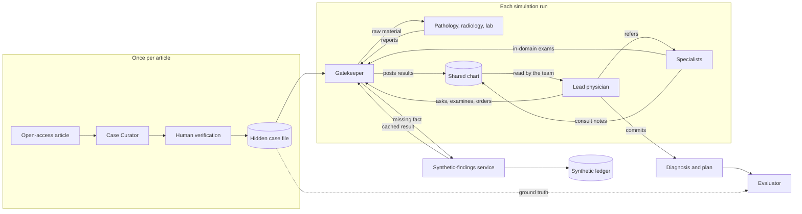
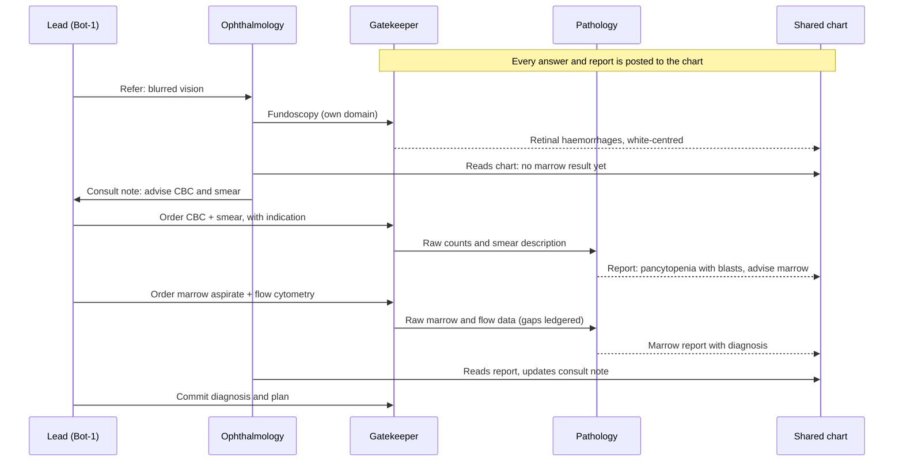
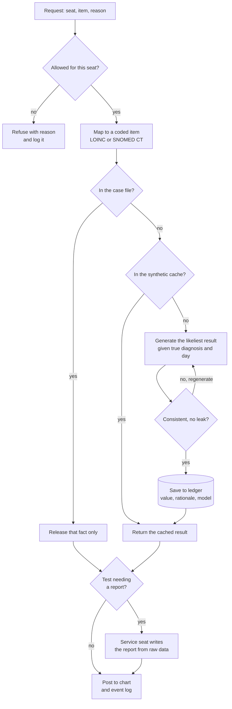
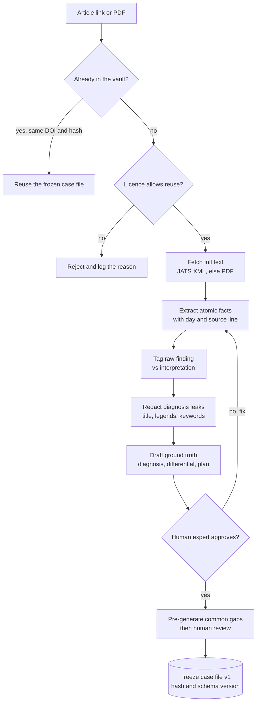
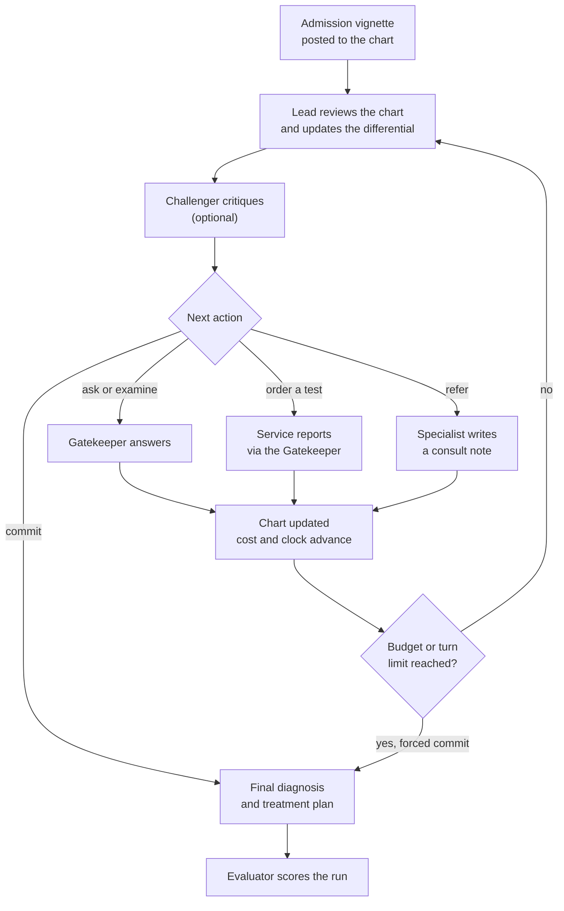
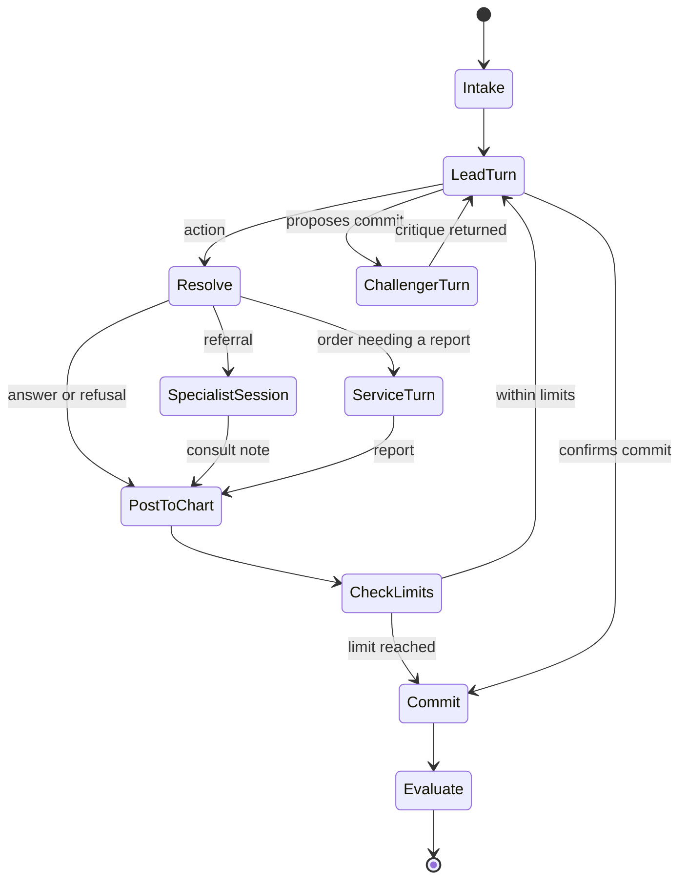

# Virtual Diagnostic Team: design spec

Version 0.1 · 24 Sep 2026 · Owner: Dr Atul Tiwari, Vedant Research Labs
Status: design draft for building with Claude Code. Nothing here is built yet.
Companion to the living doc "Virtual Diagnostic Team: refined design and build verdict".

---

## 0. What we are building

A sequential-diagnosis simulator built from open-access, published case reports. A team of seats (a lead physician, specialists and diagnostic services) works up a hidden case step by step. A Gatekeeper releases facts only when asked. A Synthetic-findings service fills gaps the article never reported. An Evaluator scores the result.

Order of use:

1. Research simulation and benchmark.
2. Publication.
3. Teaching game, where students can take any seat.

Out of scope: clinical decision support, real patient data, and simulating the outcomes of alternative treatments in research mode.

Closest prior work: Microsoft AI's MAI-DxO and SDBench (arXiv 2506.22405, 2025). Their Gatekeeper reveals facts only on explicit request and synthesises results for tests missing from the case. This project adds mid-work-up specialty referral, order-driven pathology and radiology reporting, a cached and replayable synthetic ledger, open-access-only cases, and human-swappable seats.

---

## 1. Design principles

| # | Principle | Consequence |
| --- | --- | --- |
| P1 | The information barrier lives in data and code, never in prompts. | No seat has file, database or web access. A seat sees only the view the engine builds for it. |
| P2 | The engine schedules. Models never decide who acts next. | Deterministic turn order and reproducible transcripts. |
| P3 | Every seat can be an LLM or a human, with an identical view. | `Seat.act(view) -> Action` is the only interface. |
| P4 | The Gatekeeper selects stored text. It never writes its own. | A model only maps a request to fact codes, so paraphrase leaks and "tell me the diagnosis" tricks cannot work. |
| P5 | One rule for missing facts: the most likely result for this patient, given the true diagnosis and the day. | Results are cached and ledgered. Never answer "not available", and never flag a result as synthetic during play. |
| P6 | Append-only event log and a clean state for every run. | Runs can be replayed, audited and published. No memory carries over between runs. |

### System overview



---

## 2. Seats and services

| Seat | Sees | Actions | Default player |
| --- | --- | --- | --- |
| Case Curator (offline) | The full article | Extract, tag and redact facts; draft the ground truth | LLM, then human sign-off |
| Gatekeeper (service) | Case file, media, synthetic ledger | Resolve requests, carry out orders, post to the chart, refuse | Code plus a small classifier model |
| Synthetic-findings service | Case file including the ground truth; reference sources | Generate, check, cache and log missing results | An LLM from a different family from the doctor seats (for example MedGemma); human review for the study set |
| Lead physician | The chart | AskHistory, Examine, OrderTest, Refer, UpdateDifferential, Commit | LLM or human |
| Challenger (optional) | The chart and the lead's differential | Challenge | LLM |
| Specialist (one seat per specialty) | The chart, after referral | AskHistory, Examine (own domain), BedsideTest (own domain), ConsultNote | LLM or human |
| Diagnostic service (Pathology and Lab Medicine, Radiology, Microbiology) | Its order, the clinical details on the requisition, and the raw material | Report, with optional reflex-test suggestions | LLM (with vision) or a resident |
| Evaluator | Everything, after the run | Score | LLM rubric plus human raters |
| Patient voice (game only) | History facts | Answer in lay words | LLM persona |

---

## 3. Actions

Pydantic-style sketch. Every seat returns exactly one action per turn as structured output.

```python
from typing import Literal
from pydantic import BaseModel

class AskHistory(BaseModel):
    question: str

class Examine(BaseModel):
    system: str                    # e.g. "eye", "abdomen"
    manoeuvre: str | None = None   # e.g. "dilated fundoscopy"

class OrderTest(BaseModel):
    item: str                      # free text; the Gatekeeper maps it to LOINC / SNOMED CT
    indication: str                # the clinical details written on the requisition
    urgency: Literal["routine", "urgent"] = "routine"

class Refer(BaseModel):
    specialty: str
    question: str

class ConsultNote(BaseModel):
    findings: str
    impression: str
    recommendations: list[str]     # tests or referrals the lead may act on

class Report(BaseModel):
    order_id: str
    report_text: str
    impression: str
    suggested_reflex_tests: list[str] = []

class DifferentialItem(BaseModel):
    diagnosis: str
    probability: float
    evidence_for: list[str]        # event ids
    evidence_against: list[str]

class UpdateDifferential(BaseModel):
    items: list[DifferentialItem]

class Challenge(BaseModel):
    critique: str
    alternatives: list[str]

class Commit(BaseModel):
    final_diagnosis: str
    differential: list[DifferentialItem]
    treatment_plan: str
    evidence: list[str]            # event ids that support the diagnosis
```

The engine replies with `Answer(event_id, text)`. The internal `source` field (article, synthetic or refusal) is stored in the event log and never shown to seats during play.

### Permission matrix

| Action | Lead | Specialist | Diagnostic service | Challenger |
| --- | --- | --- | --- | --- |
| AskHistory | yes | yes, after referral | no | no |
| Examine | general examination | own-domain manoeuvres | no | no |
| BedsideTest | no | own domain only | no | no |
| OrderTest | yes | recommend in ConsultNote | suggest reflex tests in Report | no |
| Refer | yes | recommend in ConsultNote | no | no |
| ConsultNote | no | yes | no | no |
| Report | no | no | its own orders only | no |
| UpdateDifferential | yes | no | no | proposes via Challenge |
| Commit | yes | no | no | no |

A manoeuvre catalogue maps examination manoeuvres and bedside tests to the specialties allowed to perform them. Examples: slit-lamp and dilated fundoscopy go to ophthalmology; nerve conduction goes to neurology. It is configurable per study.

### Worked example: ophthalmology needs the bone-marrow result



---

## 4. Gatekeeper



Release rules, adapted from SDBench's physician-written gatekeeper rules:

1. Release only what a clinician could legitimately obtain with the requested action.
2. No impressions, interpretations or hints. Diagnostic services interpret; the Gatekeeper never does.
3. Imaging and pathology material goes to the service seat as raw material. The chart receives the service's report.
4. Release pathognomonic findings only when the exact confirmatory test is ordered.
5. Refuse vague requests ("any labs?", "tell me everything") with a reason: ask for a specific item.
6. Refuse and log any request for the diagnosis, the article or its source as a protocol violation.
7. Release stored text only. The matching model returns fact ids or codes, never prose.

Coding: check a local synonym table first ("CBC", "hemogram" and "complete blood count" map to one code), then fall back to LOINC for laboratory tests and SNOMED CT for findings and procedures. Unmatched items are logged for curation.

Time: every fact carries a day. A request at simulated day d returns the value for the latest timepoint at or before d, or the synthetic value for day d.

---

## 5. Synthetic-findings service

Inputs: the frozen case file including the ground truth; the patient's state at day d (demographics, comorbidities, values already released); the coded item; reference sources (reference ranges and textbook descriptions).

Output, one row in `synthetic_ledger`:

- Values with units and reference ranges, or a narrative when the item is raw material for a report
- Rationale: why this value, given the truth
- Confidence
- Checks: consistency (no contradiction with any fact or earlier synthetic value) and leakage (no diagnosis name or synonym; nothing pathognomonic unless the exact confirmatory test was ordered)
- Generator model and version, prompt version, created time, reviewer and review status

Rules:

- Give the most likely result for this patient, given the true diagnosis, comorbidities and day. A result is normal only when nothing in the truth would change it.
- Make it no more diagnostic than real life. No textbook-perfect certainty.
- Add no incidental findings unless the article implies them.
- Cache key: (case_id, code, day_bucket). The same request always returns the same row.
- At curation, pre-generate a standard panel per case (CBC, renal and liver function, electrolytes, urinalysis, chest X-ray, ECG) and have it reviewed by a human.
- Use a different model family from the doctor seats.
- Never mark a result as synthetic during play. Reveal it in the game debrief and in the published data.

---

## 6. Case curation pipeline



1. **Identify.** Record the DOI, the PMCID and a content hash of the full text. Skip the article if it is already frozen.
2. **Licence gate.** CC0 and CC BY articles can go into the released benchmark and the game. CC BY-NC and CC BY-NC-SA articles go into a research-only subset. Exclude ND-licensed and unlicensed articles from anything released.
3. **Fetch.** Get JATS XML through PMC's approved services (OAI-PMH, E-utilities, BioC). Use the PDF only as a fallback.
4. **Extract atomic facts.** Record category, code, value, unit, day, raw or interpretation, a reveals-diagnosis flag, and the source quote.
5. **Redact.** Remove the diagnosis from the title, the abstract's conclusion, keywords, figure captions and the discussion. Write a 2–3 sentence admission vignette with no diagnosis.
6. **Ground truth.** Record the final diagnosis (code, text and accepted synonyms), the accepted differential, the treatment given and the outcome. Add case-specific critical actions: must-do items (for example, start ATRA at once in suspected APL) and must-not-do items (for example, no steroids before a lymph-node biopsy for suspected lymphoma).
7. **Human verification.** Accept or edit each fact, sign off, then freeze with a hash and the schema version.
8. **Pre-generate** the standard synthetic panel, then have a human review it.

Automatic redaction is not enough on its own. CUPCase's automated diagnosis removal still leaked the diagnosis in 14% of cases.

---

## 7. Engine

### Diagnostic loop



### State machine



A specialist session gives the specialist up to K actions (history, own-domain examination, bedside tests). It must end with a ConsultNote.

### Seat interface

```python
from typing import Protocol

class Seat(Protocol):
    seat_id: str
    role: str
    def act(self, view: "SeatView") -> "Action": ...

# LLMSeat: model id, role card, JSON-schema output, retry on invalid output
# HumanSeat: waits for the UI or CLI and receives the same SeatView
```

A `SeatView` holds the role card, the chart events visible to that seat and the seat's own earlier notes. It also shows the limits remaining. Service seats get only their order, the requisition's clinical details and the raw material.

### Limits, clock and costs

Starting defaults, to be tuned per study:

- Budget: a set amount in INR per case
- Lead turns: at most 30
- Referrals: at most 4
- Prices: a table in INR keyed by code (for example CGHS rates). Unmatched items are priced by an estimator and flagged.

| Item | Default turnaround |
| --- | --- |
| History question | 5 min |
| Examination | 10 min |
| Bedside test (ECG, fundoscopy) | 15 min |
| Specialist consult | 4 h |
| Routine labs (CBC, renal and liver function) | 4 h |
| Specialised labs (flow cytometry, serology) | 24 h |
| X-ray / ultrasound | 1 h / 4 h |
| CT / MRI | 6 h / 24 h |
| FNAC or cytology | 24 h |
| Biopsy histopathology | 72 h |
| IHC on an existing block | 48 h |
| Culture | 72 h |
| Molecular test | 7 days |

---

## 8. Data model (Postgres on self-hosted Supabase)

Types are indicative.

```sql
source_article(id uuid pk, doi text, pmcid text, title text, journal text, pub_year int,
               licence text, url text, content_hash text, fetched_at timestamptz)

case_file(id uuid pk, source_id uuid fk, schema_version text,
          status text check (status in ('draft','verified','frozen')),
          vignette text, verified_by text, frozen_hash text, created_at timestamptz)

fact(id uuid pk, case_id uuid fk,
     category text,           -- history, exam, lab, imaging, pathology, microbiology, treatment, outcome
     code_system text, code text, label text, value text, unit text, day numeric,
     kind text,               -- raw | interpretation
     reveals_dx boolean, access_tier text, release_text text, source_quote text)

media(id uuid pk, case_id uuid fk, figure_no text, modality text, file_path text,
      redacted_caption text, licence text)

ground_truth(case_id uuid pk, final_dx_code text, final_dx_text text, accepted_synonyms text[],
             accepted_differential text[], treatment_given text, outcome text,
             must_do text[], must_not_do text[])

synthetic_ledger(id uuid pk, case_id uuid fk, code text, day_bucket int, value jsonb,
                 narrative text, rationale text, confidence numeric, checks jsonb,
                 generator_model text, prompt_version text,
                 review_status text,  -- pending | approved | edited | rejected
                 reviewed_by text, created_at timestamptz,
                 unique (case_id, code, day_bucket))

run(id uuid pk, case_id uuid fk, engine_version text, config jsonb,  -- seats, models, params, limits
    started_at timestamptz, ended_at timestamptz, status text)

event(id bigserial pk, run_id uuid fk, seq int, sim_time numeric, seat text,
      type text,         -- request, answer, refusal, order, report, consult_note, differential, challenge, commit
      payload jsonb, visibility text[],
      source text,       -- article | synthetic | seat | engine  (never shown to seats)
      model text, tokens_in int, tokens_out int, cost_usd numeric, hash text)

"order"(id uuid pk, run_id uuid fk, ordered_by text, code text, item_text text, indication text,
        status text, cost_inr numeric, ordered_at_sim numeric, resulted_at_sim numeric)

score(run_id uuid pk, dx_score int, dx_rank int, plan_rating text, must_do_hit int,
      must_not_do_hit int, cost_inr numeric, sim_hours numeric, turns int,
      unnecessary_tests int, referrals_justified int, referrals_missed int,
      safety_flags text[], synthetic_dependence numeric, rater text, rater_type text)
```

The chart is a view over `event` rows whose `visibility` includes the team. Service seats see only the events for their own orders.

Mapping to the earlier seven-entity simulator plan:

| Earlier plan | This spec |
| --- | --- |
| Case | case_file |
| Patient | case_file.vignette plus history facts |
| Investigation | fact plus order |
| DiagnosticPath | ground_truth, plus a reference expert path |
| ScoringRubric | Evaluator configuration |
| SyntheticDataLog | synthetic_ledger |
| Disease | reference table of codes and synonyms |

---

## 9. Evaluation

- **Diagnosis.** Use an SDBench-style 5-point rubric. A score of 4 or more counts as correct.
    - 5: identical, or more specific
    - 4: core disease correct, and the difference would not change management
    - 3: right category, but a major error in cause, site or specificity
    - 2: superficial overlap that would misdirect the work-up
    - 1: unrelated, or harmful
- **Differential.** Rank of the true diagnosis in the final differential (top 1 and top 3).
- **Plan.** Must-do items hit and must-not-do items violated. Give an overall rating of appropriate, acceptable or unsafe, against current guidelines and the article.
- **Process.** Cost in INR, simulated hours, turns, and referrals (justified and missed). Rate each test as essential, supportive, low-yield, unnecessary or risky.
- **Synthetic dependence.** The share of `Commit.evidence` events whose source is synthetic. Flag runs above a set threshold.
- **Raters.** The LLM Evaluator scores every run, and two clinicians rate a stratified sample. Report Cohen's kappa and adjudicate disagreements. Changing the judge model shifts scores, so pin it.

---

## 10. Research protocol (draft)

- **Case set.** Frozen and hashed, split into CC BY and CC BY-NC subsets. Where possible, use cases published after the training cutoffs of every model tested. Perturb non-essential details such as exact age, place and dates.
- **Memorisation probe.** Each model gets a vignette-only guess, to detect cases it has memorised.
- **Arms:**
    - A: a single-agent lead with no specialists
    - B: lead plus specialists and services
    - C: B plus a Challenger
    - D: a human trainee as lead, with AI specialists
    - E: a MAI-DxO-style single-model panel as the baseline
- **Models.** Use 3–4 model families and pin their snapshots. Set temperature 0 where supported. Run at least 3 repeats per case and report the variance.
- **Runner.** An Inspect AI task: cases are the dataset and seats are model roles, with cost limits and caching. Also write every call to `event`.
- **Reporting.** Pre-register and follow the TRIPOD-LLM reporting guideline. Release the CC BY case files, the ledger and the logs.
- **Ethics.** Confirm with the institutional ethics committee whether an exemption is needed. The cases are public, de-identified and published with consent.

---

## 11. Teaching-game mode

- Students take the lead or pathology seat, and AI fills the rest.
- Difficulty comes from the budget size, an unreliable-historian patient (game only) and fewer allowed consults.
- The debrief compares the student's path with the expert path and the AI path. It reveals the synthetic items, the cost and time, and any missed must-dos.
- Theatre mode: the engine mirrors each seat's messages into a Discord channel through webhooks, with one name and avatar per seat. A Hermes persona is optional, for students who want to chat with the "attending".
- Disclaimer on every screen: educational simulation, not for clinical use.

---

## 12. Tech stack

| Layer | Choice |
| --- | --- |
| Engine and API | Python 3.12, FastAPI, Pydantic v2 |
| Storage | Postgres on self-hosted Supabase (Coolify) |
| Cloud models | OpenRouter, or a version-pinned LiteLLM with hash-locked dependencies |
| Local models | Ollama for development; vLLM on a rented GPU for study runs |
| Experiments | Inspect AI |
| Tracing | Arize Phoenix (light), or Langfuse if the VPS has about 16 GB of RAM |
| Game UI | Next.js |
| Operations | Hermes Agent: launch batches and send Telegram digests |

Suggested layout:

```text
dxteam/
  engine/        scheduler.py  seats.py  actions.py  views.py  limits.py
  gatekeeper/    policy.py  resolver.py  coding.py  synonyms.csv
  synthetic/     generator.py  consistency.py  leakcheck.py  cache.py
  curation/      fetch_pmc.py  extract.py  redact.py  ground_truth.py
  evaluation/    rubrics.py  evaluator.py  metrics.py
  storage/       models.py  migrations/
  api/           app.py            # FastAPI, later serves the game
  experiments/   inspect_task.py
  web/           (Next.js, phase 3)
```

---

## 13. Phase 0–1 tasks

### Phase 0: case pipeline

- [ ] T0.1 Create the schema in section 8 as Supabase migrations.
- [ ] T0.2 PMC fetcher: DOI or PMCID in; licence, JATS XML (PDF fallback), content hash and de-duplication out.
- [ ] T0.3 Curator: JATS to atomic facts (JSON schema), with raw or interpretation tags, reveals-diagnosis flags and source quotes.
- [ ] T0.4 Redactor and vignette writer, with an automated leak scan for the diagnosis and its synonyms.
- [ ] T0.5 Ground-truth drafter, including must-do and must-not-do items.
- [ ] T0.6 Review screen to accept or edit facts and freeze a case (a simple Next.js page, or Supabase Studio views).
- [ ] T0.7 Curate 5 CC BY haematology cases end to end.

Done when: 5 frozen, human-verified case files exist and the leak scan is clean.

### Phase 1: prototype engine

- [ ] T1.1 Action and SeatView models; an LLMSeat with JSON-schema output and retries; a HumanSeat stub (CLI).
- [ ] T1.2 Gatekeeper: permission matrix, request-to-code matcher (returns ids only), release from stored text, refusals.
- [ ] T1.3 Synthetic service: generator, consistency and leak checks, cache, ledger.
- [ ] T1.4 Scheduler and state machine, with limits, clock, costs and the event log.
- [ ] T1.5 Seats: lead, one specialist (ophthalmology or internal medicine), and a Pathology and Lab Medicine service.
- [ ] T1.6 Evaluator with the diagnosis and plan rubrics.
- [ ] T1.7 Transcript viewer: read one run's events in order.
- [ ] T1.8 Run all 5 cases with 2 models, read the transcripts and fix any leaks.

Done when: all 5 cases run end to end, reruns return identical Gatekeeper and synthetic answers, and review finds no leaks.

---

## 14. Decisions needed

1. Specialties in v1. Suggested: internal medicine, ophthalmology and neurology, plus pathology and lab medicine, and radiology.
2. Models for the doctor seats, the generator and the Evaluator, and the budget per run.
3. The price table (CGHS?) and the turnaround defaults.
4. Who verifies cases and who rates runs (residents? co-authors?).
5. Target journal or venue, and whether to pre-register.
6. Commercial plans for the game. This decides whether to use CC BY-only cases or CC BY-NC cases too.

---

## References

- Nori H, et al. Sequential Diagnosis with Language Models (MAI-DxO, SDBench). arXiv 2506.22405, 2025. https://arxiv.org/abs/2506.22405
- Revised SDBench manuscript (Nov 2025). https://www.erichorvitz.com/sequential_diagnosis_LM.pdf
- ClinicalLab / ClinicalAgent, 2024. https://arxiv.org/abs/2406.13890
- AgentClinic, npj Digital Medicine, 2026. https://doi.org/10.1038/s41746-026-02674-7
- CUPCase (AAAI). https://ojs.aaai.org/index.php/AAAI/article/view/35050
- MultiCaRe. https://doi.org/10.1016/j.dib.2023.110008
- PMC-Patients. https://doi.org/10.1038/s41597-023-02814-8
- MedCaseReasoning. https://arxiv.org/abs/2505.11733
- PMC text mining and licences. https://pmc.ncbi.nlm.nih.gov/tools/textmining/
- Inspect AI, multi-agent. https://inspect.aisi.org.uk/multi-agent.html
- Hermes Agent profiles ("Profiles do not sandbox the agent"). https://hermes-agent.nousresearch.com/docs/user-guide/profiles
- Hermes Agent Bot Mode. https://hermes-agent.nousresearch.com/docs/user-guide/bot-mode
